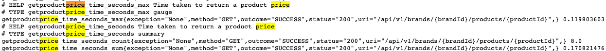

# About the Project
****
Build an application/service in SpringBoot that provides a REST endpoint such that:

* Accept as input parameters: Application Date, Product Identifier, String Identifier.
* Return as output data: product identifier, chain identifier, rate to apply, dates of application and final price to apply.

## Libraries used
****
* Spring Boot 2.6.3
* Java jdk 11
* Spring Boot devtools
* JPA
* H2
* Lombok
* Junit

## Getting Started
****
1. Build the project using `mvn clean install`
2. Run using `mvn spring-boot:run`
3. The web application is accessible via http://localhost:8080/api/v1/brands/{brandId}/products/{productId}?startDate=startDate
 * Example: http://localhost:8080/api/v1/brands/1/products/35455?startDate=2020-06-15T10:00:00
4. You can acces H2 database via http://localhost:8080/h2-ui - using user and password set in application.properties

## Monitoring and Metrics
****
For this application we enable **prometheus** metrics through **micrometer** tool both dependecies are in pom.xml file.

So in order to see our application metrics we need to query the endpoint http://localhost:8080/actuator/prometheus in our browser
in there we can see all the information of our application.

As we can see in the picture you can see the number of times the GET endpoint was query and an average of response time.

## Versions
****
1.0.0-SNAPSHOT: Contains GET endpoint for query the finalPrice of an item depending on the brand, product id and date

## Developers
****
**Carlos Antonio Arredondo Rodriguez (carlosar@hotmail.com)**
